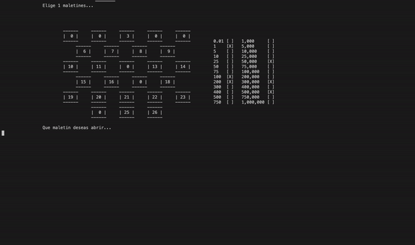

# Deal or No Deal

Final project for my programming fundamentals course.
#

## How was this built?
- C - standard libraries

## What did I learn?
- Variables
- Arrays
- Loops
- Structures
- Functions
- File manipulation
- Dynamic memory allocation

## Installation

1. Clone the repository.
2. Make sure you have `gcc`installed.
3. Open terminal on project's directory.
4. Run `gcc maingame2.c -o maingame` to compile.
5. `./maingame` to run the program.

## Usage
As this project runs entirely on the command line, the only control is the keyboard.
1. When running the program you'll be recieved with this screen.

  

2. First you´ll need to register to play. (press `2`)

  
   
  Set username and password and you'll be brought back to the main screen.

3. Press `1` to start playing. You will first need to sign in.

  
   
  Chose your starting suitcase, then start picking other cases using the numbers on the keyboard.

4. After you´ve opened a certain amount of cases, the bank will make an offer.

  
   
  Press <code>1</code> to accept the offer or <code>2</code> to decline and continue playing.

5. If you decline all the offers and reach the last case, you´ll be granted a choice. Keep the first case you chose or take home the remaining case.

  
   
  Press <code>1</code> to keep your case or <code>2</code> take the remaining case.

6. After finishing every game, your stats will be saved and you´ll return to the main screen. Press `3` and enter your username to view your stats. 

  

7. Finally, you can press `4`to exit the program. And don´t worry, your stats will be saved.

## Contributing
Pull requests are welcomed. For major changes, please open an issue first to discuss what you would like to change.

#
Manuel Rodriguez Urdapilleta

29/01/2021

